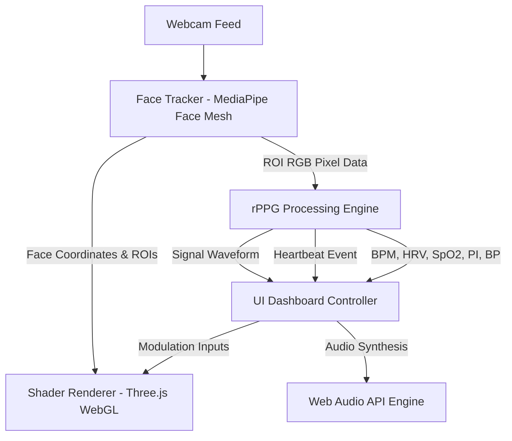

# Aura Scanner & Clinical Biometric Interface

A real-time, GPU-accelerated web application that performs camera-based remote photoplethysmography (rPPG) to analyze and visualize human biological signals. 

This project features a **Dual-Mode UI** that can switch instantly between an esoteric/spiritual **Bio-Spectral Interface** (visualizing auric fields and chakra energy bars) and a professional **Clinical Diagnostics Interface** (providing clinical-grade health measurements like SpO2, blood pressure, perfusion index, RMSSD, SDNN, and ECG sonification).

---

## 🌟 Core Features

- **Dual-Mode System**:
  - **Bio-Spectral Mode**: Visualizes the user's emotional and cognitive energy fields via glowing fluid WebGL shaders ("Spirit Flow", "Chakra Flame") and maps chakra resonance bars.
  - **Clinical Diagnostics Mode**: Swaps the UI to a clean medical teal/blue theme, presenting professional diagnostic charts, physiological telemetry (SpO2, Blood Pressure, Perfusion), and clinical Autonomic Nervous System (ANS) balance indicators (Sympathetic vs. Parasympathetic tone).
- **GPU-Accelerated WebGL Rendering**: Renders real-time, face-fitting fluid simulations and organic particle systems directly on a WebGL overlay.
- **Microvascular Blood Volume Pulse (BVP) Tracking**: Extracts heart beats from micro-color changes in face skin using a webcam.
- **ECG Heartbeat Sonification**: Synthesizes authentic patient monitor ECG beeps and atmospheric binaural audio waves in real time.
- **Biometric PDF Reporting**: Compiles and exports printable clinical reports or spectral aura assessments.

---

## 🛠️ Technical Architecture

The application is built entirely client-side using a clean, vanilla JavaScript module system:



- **Computer Vision**: Uses **MediaPipe Face Mesh** to track 468 landmarks on the face and extract three distinct Regions of Interest (ROI): the forehead, left cheek, and right cheek.
- **Signal Processing**: Employs the **Plane-Orthogonal-to-Skin (POS)** algorithm to isolate the vascular pulse signal from ambient light changes and facial motion, followed by a digital bandpass filter.
- **Graphics Pipeline**: Leverages **Three.js** and WebGL fragment shaders to run fluid, real-time noise-based visual effects wrapped around the user's facial geometry.
- **Sonification**: Leverages the native **Web Audio API** to synthesize real-time frequency-modulated carrier hums and ECG chime blips.

---

## 📋 Folder Structure

```
aura-scanner/
├── .github/
│   └── workflows/
│       └── deploy.yml      # CI/CD automated deployment to GitHub Pages
├── js/
│   ├── app.js              # Main application entry point and coordinator
│   ├── rppg.js             # BVP extraction, POS algorithm, and clinical calculators
│   ├── tracker.js          # MediaPipe Face Mesh tracking and ROI extraction
│   ├── shader.js           # WebGL shader renderer and particle systems
│   └── ui.js               # Dashboard interface, audio synthesis, and PDF reports
├── index.html              # Main application document layout
├── style.css               # Styling rules, layouts, and dark mode variables
└── .gitignore              # Git ignore rules
```

---

## 🚀 Setup & Installation

The application runs entirely in the browser and does not require a backend server. 

### Local Deployment
To run the project locally, serve the directory using any HTTP server:

**Using Python (Recommended)**:
```bash
python -m http.server 8080
```

**Using Node.js (`http-server`)**:
```bash
npx http-server -p 8080
```

Once running, open your web browser and navigate to `http://localhost:8080`. Ensure you grant camera permissions when prompted.

---

## 🌐 Free CI/CD & Browser Hosting

This project is pre-configured with a GitHub Actions workflow that deploys the application directly to **GitHub Pages** for free.

To set this up:
1. Create a repository on GitHub named `aura-scanner`.
2. Link your local project directory and push it:
   ```bash
   git remote add origin https://github.com/YOUR_USERNAME/aura-scanner.git
   git branch -M main
   git push -u origin main
   ```
3. On GitHub, go to your repository **Settings** > **Pages** > **Build and deployment**. Under **Source**, select **GitHub Actions**.
4. The pipeline will automatically build and publish your site at `https://YOUR_USERNAME.github.io/aura-scanner/` on every push to the `main` branch.
